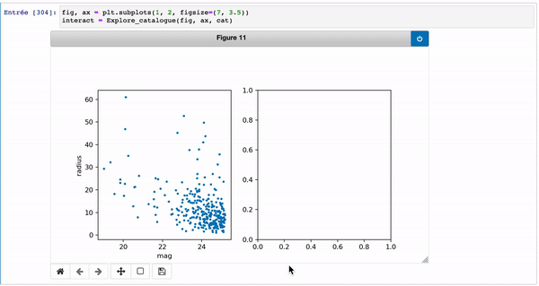

# Interactive plots with Matplotlib

Tutorials on how to create customable actions on matplotlib plots when interacting with the mouse.

I recommand to start with the basics.ipynb before going to the other tutorials.

I recommand to clone the project (do `git clone https://github.com/Hbretonniere/interactive_plots.git` in a terminal) in order to easily run the notebooks.

If not, you can always download 'by hand' the notebooks and read the paragraph below to run them.

# Tutorials :

You have curretnly three tutorials on Jupyter Notebooks, and a script in .py

`basics.ipynb` teaches you the very basics of the matplotlib `event` method.

`Tutorial_#2.ipynb` teaches you how to use the `event` with more complex but cleaner methods.

`Tutorial_#3-ipywidget.ipynb` teaches you to use the ipywidget methods.

`paint_with_plt.py` is a mini paint like wrapper with the `event` methods which allows you to do pixel art !

### Projet in construction !!

## Files

To launch a notebook, you must have Jupyter installed in your machine, and run the command `jupyter notebook name_of_the_file.ipynb` in a terminal. It will open a webpage representing the folder from which you launched the command. Then, you just need to navigate to the folder containing the `.ipynb` you want to run, and click it.

Note that the `.ipynb` files may not render in the github web page. If you really want to have a look at the notebooks before launching them through jupyter, I did a `.md` version that renders here (without the output of the cells though).

I recommand to launch the notebooks in a browser (Firefox). For example, interactive plots do not work well in VS Code.

To launch the `.py` files, use Ipython (Ipython3 is recommended...) !

## Requirements :

- matplotlib
- numpy
- jupyterlab
- scipy